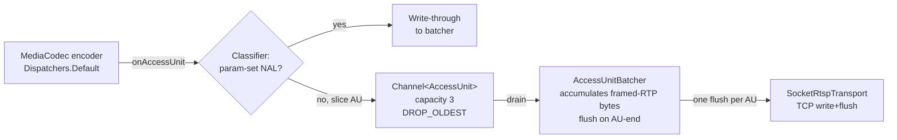

# Batch RTP writes per access unit + decouple sender from encoder drain

## Summary

Reduce Android→Mac cast stutter (freeze + catch-up jumps) by collapsing the per-RTP-packet socket flush into one flush per access unit, and by inserting a small bounded queue between the encoder's drain callback and the packetizer so encode and send can overlap. Encoder configuration stays at 1080p / 30 fps / 8 Mbps / 2 s keyframe / VBR; the wire format is unchanged.

## Problem Frame

Casting video content (YouTube, internet video) from the Android sender shows a freeze-then-jump pattern. Verified on the emulator-over-loopback path, so Wi-Fi loss is not in the cause set and the stall has to be CPU / IO / render bound. Two specific hot paths produce that signature:

- `SocketRtspTransport.writeRaw` calls `out?.write` then `out?.flush` on every RTP packet (`app/src/main/java/com/example/android_cast/cast/RtspClient.kt:197-200`). At 1080p / 30 fps with multi-slice output this is 100+ syscalls per second, each capable of stalling the worker that's also producing the next frame.
- `RtpPacketizer.sendAccessUnit` iterates NALs and emits one RTP packet per NAL via the Sender callback (`app/src/main/java/com/example/android_cast/cast/RtpPacketizer.kt:35-41`), so the per-packet flush cost is paid once per NAL rather than once per picture.

When the send path stalls, the encoder output buffer backs up; when it clears, a burst flushes and the picture jumps. The user's stated preference is to keep quality (1080p), so the fix attacks IO and scheduling overhead rather than degrading the picture.

## Requirements

Carried from origin `docs/brainstorms/2026-06-24-cast-stutter-perf-requirements.md`. R-IDs preserved.

- R1. All RTP frames for one access unit are accumulated and written to the socket in a single flush per access unit, rather than one flush per RTP packet.
- R2. The send path runs decoupled from the encoder drain callback, so encoder output is not blocked by socket write latency.
- R3. Encoder configuration (resolution, frame rate, bitrate, keyframe interval, bitrate mode) stays unchanged from the current defaults.
- R4. The bounded queue between encoder and sender must not grow unbounded under sustained backpressure; behavior under backpressure is to drop the oldest pending access unit rather than block encode.
- R5. The RTP wire format, marker-bit placement, FU-A fragmentation, and RTSP interleaving remain byte-compatible with the existing Mac receiver — no receiver-side change is required.

## Key Technical Decisions

- **Batched flush at the Sender seam, not inside `RtpPacketizer`.** The packetizer already has the right API shape (`Sender` callback per packet). The batching wraps the Sender in a new component that accumulates framed-RTP bytes for one AU and flushes once when the packetizer signals AU-end. Keeps the packetizer's byte-level behavior untouched and preserves R5.
- **`kotlinx.coroutines.channels.Channel` with capacity 3, `BufferOverflow.DROP_OLDEST`.** Capacity 3 covers one in-flight send + one queued + headroom for encoder bursts above 30 fps (VBR can produce frame bursts). DROP_OLDEST satisfies R4 and matches "newest frame wins on backpressure" UX.
- **SPS/PPS NALs bypass the queue.** Parameter-set NALs arrive both via `INFO_OUTPUT_FORMAT_CHANGED` (with `presentationTimeUs = 0L`) and prepended to the first IDR access unit. Dropping either path means the receiver decoder cannot initialize. The queue's enqueue site inspects NAL types: parameter sets are written through to the sender synchronously and never queued.
- **Consumer coroutine launched inside the existing `runBlocking` block.** `CastForegroundService` runs its handshake + collect on a single daemon thread bridged via `runBlocking`. The consumer coroutine is launched inside that block on `Dispatchers.IO` and torn down when the flow completes. Avoids introducing a second long-lived thread.
- **Sender-side backpressure does not signal the encoder.** No RTCP feedback to the encoder in this workstream (that is Approach C in the origin, deferred). The queue absorbs transient stalls; sustained stalls drop oldest and the receiver sees a frame skip.

## High-Level Technical Design



Producer side runs on whatever `Dispatchers.Default` worker dequeues the encoder output. Consumer side runs on `Dispatchers.IO` inside the existing `runBlocking` scope. Parameter-set NALs skip the queue entirely so they can never be dropped under backpressure.

## Implementation Units

### U1. `AccessUnitBatcher` — accumulate framed-RTP bytes, flush once per AU

**Goal:** Introduce a component between the packetizer's per-packet output and the socket that accumulates the 4-byte-interleaved frames for one access unit and writes them with a single `flush` when the AU ends.

**Requirements:** R1, R5.

**Dependencies:** None.

**Files:**
- `app/src/main/java/com/example/android_cast/cast/AccessUnitBatcher.kt` (new)
- `app/src/test/java/com/example/android_cast/cast/AccessUnitBatcherTest.kt` (new)

**Approach:** Wrap the existing `RtpPacketizer.Sender` interface. The batcher exposes a `send(packet: ByteArray, length: Int, endOfAccessUnit: Boolean)` method; for each call it appends the framed bytes to an internal `ByteArrayOutputStream`. When `endOfAccessUnit == true`, it calls the underlying transport's write-once-then-flush. The batcher is single-threaded-use — its caller sequences packets for one AU before signaling end. Byte output is identical to today's per-packet framing (preserves R5).

**Patterns to follow:** `RtpPacketizer.Sender` `fun interface` (`RtpPacketizer.kt:18`); `RecordingSender` fake pattern in `RtpPacketizerTest.kt` for the test.

**Test scenarios:**
- Happy path: enqueue 3 framed packets with the last marked `endOfAccessUnit=true`; assert exactly one flush call on the underlying transport, containing all three frames concatenated.
- Happy path: enqueue a single packet marked `endOfAccessUnit=true`; assert one flush with that single frame.
- Edge: enqueue packets across two AUs (first batch ends, second batch ends); assert two flush calls in order, each carrying only its own AU's bytes.
- Edge: empty AU (no `send` call between two `endOfAccessUnit` markers) — no flush fired for the empty AU.
- Error path: underlying transport throws on write — exception propagates to caller; batcher state is reset so the next AU starts clean.

**Verification:** Unit test passes; byte-for-byte equivalence with the previous per-packet framing verified by a test that captures both old and new output for the same NAL sequence and asserts equality.

---

### U2. `RtpPacketizer` — emit AU-end signal through the Sender

**Goal:** Extend the packetizer so the batcher can know when an access unit ends, without changing byte-level output.

**Requirements:** R1, R5.

**Dependencies:** U1.

**Files:**
- `app/src/main/java/com/example/android_cast/cast/RtpPacketizer.kt` (modify)
- `app/src/test/java/com/example/android_cast/cast/RtpPacketizerTest.kt` (modify)

**Approach:** Add an `endOfAccessUnit: Boolean` parameter to the `Sender` callback (default `false` to keep call sites simple). `sendAccessUnit` calls `send(...)` with `endOfAccessUnit = true` on the last NAL's final packet (the packet that carries the RTP marker bit). For fragmented NALs the flag is true only on the final FU-A fragment of the final NAL. All existing tests keep passing — byte output is identical, only a boolean flag is added.

**Patterns to follow:** Existing `Sender` `fun interface`; `RecordingSender` captures length and bytes — extend to capture the flag too.

**Test scenarios:**
- Happy path: small single-NAL AU — `send` called once with `endOfAccessUnit=true`.
- Happy path: large NAL fragmented via FU-A — last fragment carries `endOfAccessUnit=true`; earlier fragments carry `false`.
- Happy path: multi-NAL AU (e.g. SPS + PPS + IDR) — only the final packet of the final NAL carries the flag.
- Regression: existing `RtpPacketizerTest` scenarios still pass (sequence numbers, marker bits, SSRC, timestamp scaling).

**Verification:** `./gradlew :app:testDebugUnitTest` passes including all pre-existing packetizer tests.

---

### U3. Bounded `AccessUnitQueue` with parameter-set bypass

**Goal:** Decouple the encoder's drain callback from the sender (R2) with a bounded queue that drops oldest under backpressure (R4) and never queues parameter-set NALs.

**Requirements:** R2, R4.

**Dependencies:** U1.

**Files:**
- `app/src/main/java/com/example/android_cast/cast/AccessUnitQueue.kt` (new)
- `app/src/test/java/com/example/android_cast/cast/AccessUnitQueueTest.kt` (new)

**Approach:** A `kotlinx.coroutines.channels.Channel<AccessUnit>` with capacity 3 and `BufferOverflow.DROP_OLDEST`. The producer side (`enqueue`) inspects each AU's NAL types before queueing: if every NAL is a parameter set (type 7 SPS or type 8 PPS), or if the AU contains parameter sets mixed with slices (the first-IDR case where SPS/PPS are prepended), the AU is delivered to a synchronous bypass path that writes through to the batcher immediately without touching the queue. Pure-slice AUs go through the queue. The consumer side drains the channel on `Dispatchers.IO` and forwards each AU to the batcher.

**Technical design (directional):**

```
enqueue(au):
  if au contains any parameter-set NAL:
    bypass.send(au)         // synchronous write to batcher
  else:
    channel.trySend(au)     // DROP_OLDEST if full
```

**Patterns to follow:** `kotlinx-coroutines-test` pattern from `CastViewModelTest.kt` (`runTest`, `StandardTestDispatcher`).

**Test scenarios:**
- Happy path: enqueue 3 slice AUs, consumer drains all 3 in order.
- Edge (drop-oldest): fill the channel to capacity, enqueue one more — the oldest pending AU is dropped, the newest is retained, no exception thrown.
- Edge (bypass): enqueue an AU containing an SPS NAL — assert the bypass sink received it and the channel is empty.
- Edge (bypass with mixed): enqueue an AU with [SPS, PPS, IDR] (the first-frame case) — assert bypass sink received it; channel empty.
- Integration: enqueue one bypass AU then one slice AU — bypass fires synchronously, slice goes through the channel and arrives on the consumer; ordering preserved within each path.
- Error path: consumer is cancelled mid-drain — producer's `trySend` returns closed-channel failure, surfaces as a logged drop without throwing.

**Verification:** `./gradlew :app:testDebugUnitTest` passes new tests; existing tests unaffected.

---

### U4. Wire the queue + batcher into `CastForegroundService`

**Goal:** Replace the direct `onAccessUnit → packetizer.sendAccessUnit` lambda with the new pipeline: encoder callback → `AccessUnitQueue` → consumer coroutine → `AccessUnitBatcher` → `SocketRtspTransport`.

**Requirements:** R1, R2, R4, R5.

**Dependencies:** U1, U2, U3.

**Files:**
- `app/src/main/java/com/example/android_cast/cast/CastForegroundService.kt` (modify)

**Approach:** Inside the existing `Thread { ... runBlocking { ... } }` block (currently `CastForegroundService.kt:77-139`):
1. Construct `AccessUnitBatcher` wrapping the transport.
2. Construct `AccessUnitQueue` with the batcher as its consumer sink (both the bypass path and the channel-drain path write into the batcher).
3. Launch a consumer coroutine on `Dispatchers.IO` inside the `runBlocking` scope that drains the queue and forwards each AU to the batcher.
4. Hand the `MediaProjectionScreenCaptureEngine` an `onAccessUnit` lambda that calls `queue.enqueue(AccessUnit(...))`.
5. On flow completion or service stop, cancel the consumer coroutine and close the queue.

The encoder's `onAccessUnit` lambda is now non-blocking — it just enqueues. Encode and send overlap because the encoder's `Dispatchers.Default` worker is no longer blocked by `flush()` syscalls.

**Patterns to follow:** Existing `runBlocking { eng.start(receiver).collect { } }` block at `CastForegroundService.kt:128-134`; `android.util.Log.i/e` with "MirrorCast" tag for lifecycle and error logging.

**Test scenarios:**
- Test expectation: none — `CastForegroundService` is an Android `Service` with no JVM-testable surface. Verification is via manual end-to-end test (see Plan Verification below).

**Verification:**
- Build: `./gradlew :app:assembleDebug` succeeds.
- Unit tests: `./gradlew :app:testDebugUnitTest` passes — no regressions in `RtpPacketizerTest`, `RtspClientTest`, `CastViewModelTest`.
- Manual end-to-end: with the Mac `ios_cast` scheme running, cast from the Android emulator and play a YouTube video for 60+ seconds. The freeze-then-jump pattern should be visibly reduced (no more than one visible stall per minute). HUD fps readout stays ≥ 25 during sustained playback.

---

## Scope Boundaries

### Deferred to Follow-Up Work

- **Approach B — Mac-side jitter buffer / display queue depth.** If U1–U4 lands and the stutter persists, the next suspect is the display-layer drop at `ios_cast/ios_cast/CastReceiver.swift:358-366`. Tracked in the origin doc as Approach B.
- **Approach C — wire `AdaptiveBitrate` to RTCP receiver reports.** Belongs in a real-Wi-Fi workstream where loss/RTT signals fire. Tracked in the origin doc as Approach C; the `AdaptiveBitrate` class already exists.
- **Mac window sizing / fullscreen / maximize-to-fill.** Separate workstream; the user has flagged this as a separate concern.

### Outside this workstream's identity

- Lowering the default resolution or bitrate ceiling.
- Switching transport (UDP RTP, or TCP fallback negotiation).

## Risks & Dependencies

- **Risk: encoder bursts above 30 fps could exceed queue capacity even at 3.** Mitigation: DROP_OLDEST handles this gracefully; the receiver sees a frame skip rather than a stall. Capacity 3 is the empirical sweet spot for one in-flight + one queued + headroom.
- **Risk: parameter-set NALs lost if the bypass path has a bug.** Mitigation: U3's test scenarios cover both pure-parameter-set AUs and the mixed first-frame case ([SPS, PPS, IDR]).
- **Risk: consumer coroutine leaks if `runBlocking` exits without cancellation.** Mitigation: U4 explicitly cancels the consumer in the flow-completion / stop path.
- **Dependency:** `kotlinx-coroutines-core` must already include `Channel` with `BufferOverflow` — verify in `gradle/libs.versions.toml` (the `kotlinx-coroutines-test` dependency already pulls it in transitively).
- **Assumption:** the freeze-then-jump cause is sender-side IO/scheduling, not Mac-side decode. If U1–U4 lands and the stutter is unchanged, the diagnosis is wrong and Approach B becomes the lead hypothesis.

## Open Questions

- **Deferred to implementation:** whether the batcher's internal buffer is a `ByteArrayOutputStream` or a manually-managed `ByteArray`. Either satisfies R1; the choice has no test-visible effect.
- **Deferred to implementation:** whether the consumer coroutine uses `channel.consumeEach { }` or an explicit `for (...)` loop. Both are correct; pick whichever reads cleaner alongside the existing `runBlocking` shape.

## Sources & Research

- Origin: `docs/brainstorms/2026-06-24-cast-stutter-perf-requirements.md` — R1–R5, scope boundaries, deferred approaches B and C.
- Grounding dossier: `/tmp/compound-engineering/ce-brainstorm/mirrorcast-perf/grounding.md` — verbatim quotes with `file:line` pointers across the cast pipeline.
- Claim verification (run during the brainstorm): confirmed per-packet flush at `RtspClient.kt:197-200`, per-NAL send loop at `RtpPacketizer.kt:35-41`, static encoder defaults at `MediaProjectionScreenCaptureEngine.kt:36-39` and `:146-154`, unwired `AdaptiveBitrate`. One refutation: the encoder drain loop runs on `Dispatchers.Default` (a pool), not on the `cast-engine` thread — the fix is the same, the mechanism is "stop blocking a pool worker with per-packet syscalls."
- Local research (planning-time): confirmed no existing producer/consumer primitives in `app/`; confirmed `RecordingSender` / fake-Transport test pattern extends cleanly to the new components; confirmed `runBlocking` shape in `CastForegroundService` can host a consumer coroutine on `Dispatchers.IO`.
